# Data Cleaning Tutorial

Disclaimer: This tutorial is adapted from [
Alex The Analyst's Data Cleaning tutorial](https://www.youtube.com/watch?v=8rO7ztF4NtU) with the following improvements:
1. You can run it from the top and produce the same results. Each run drops old data and loads fresh data so the behavior will be consistent between runs and you don't have to select a portion of the code to run each time. **Note this is dangerous in Production environments!!!**

**I do NOT own the data. The data is for demonstration purposes only. This tutorial is for educational purposes only.**

This tutorial uses Microsoft SQL Server to perform data cleaning on Mac.  

## Prerequisite

### Preparing SQL Server
1. Install SQL Server and Azure Data Studio on Mac: [follow this guide](https://database.guide/how-to-install-sql-server-on-a-mac/) and confirm Azure Data Studio can connect to SQL Server
1. In the terminal run `docker container ls` and copy the ID of the SQL Server Container

### Preparing CSV
1. Open `data.xlsx`, save as CSV format (also uploaded as `data.csv`)
1. In the terminal run `docker cp <pathToCSV> <dockerContainerID>:/data.csv`. This copies the CSV file to the docker so SQL Server has proper access privilege to read the file

## Steps (Full Script in `t.sql`)
1. Load the data from `/data.csv` in Docker to a table called `DataCleaningTutorial.dbo.NashvilleHousing`
```
-- 1. Load data
---- Create new database if it does not exist already
USE master -- execute from master database
GO

IF NOT EXISTS (
    SELECT *
        FROM sys.databases
        WHERE name = 'DataCleaningTutorial'
)
CREATE DATABASE DataCleaningTutorial
USE DataCleaningTutorial
GO

---- Create table
DROP TABLE IF EXISTS NashvilleHousing;
CREATE TABLE NashvilleHousing (
    UniqueID INT PRIMARY KEY,
    ParcelID VARCHAR(255),
    LandUse VARCHAR(255),
    PropertyAddress VARCHAR(255),
    SaleDate VARCHAR(255),
    SalePrice VARCHAR(255),
    LegalReference VARCHAR(255),
    SoldAsVacant VARCHAR(255),
    OwnerName VARCHAR(255),
    OwnerAddress VARCHAR(255),
    Acreage DECIMAL,
    TaxDistrict VARCHAR(255),
    LandValue INT,
    BuildingValue INT,
    TotalValue INT,
    YearBuilt INT,
    Bedrooms INT,
    FullBath INT,
    HalfBath INT
)
GO

---- Read CSV
BULK INSERT NashvilleHousing FROM '/data.csv'
WITH
(
    FORMAT = 'CSV',
    FIRSTROW = 2,               -- Skip CSV header row
    -- FIELDTERMINATOR = ',',   -- Redundant
    -- ROWTERMINATOR = '\n',    -- Redundant
    -- TABLOCK,                 -- Redundant
    KEEPNULLS                   -- Treat empty fields as NULLs
)

---- Confirm data is loaded into table
SELECT TOP 10 * 
FROM NashvilleHousing
```
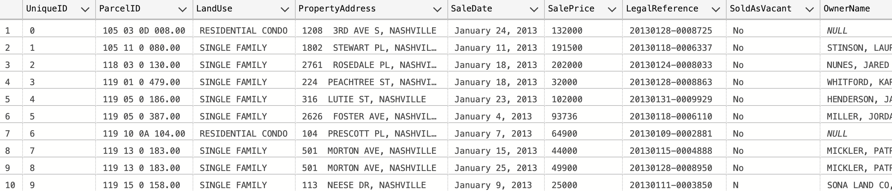

2. Convert `SaleDate` from `VARCHAR(255)` to `DATE`
```
-- 2. Standardize Date Format
---- Preview converting SaleDate to DATE
SELECT TOP 10 SaleDate, CONVERT(DATE, SaleDate)
FROM NashvilleHousing
```
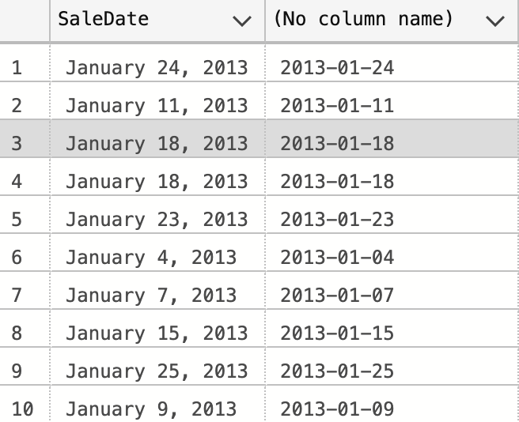

```
---- Convert SaleDate to DATE
UPDATE NashvilleHousing 
SET SaleDate = CONVERT(DATE, SaleDate)

---- Confirm SaleDate is converted to DATE
SELECT TOP 10 UniqueID, SaleDate 
FROM NashvilleHousing
```
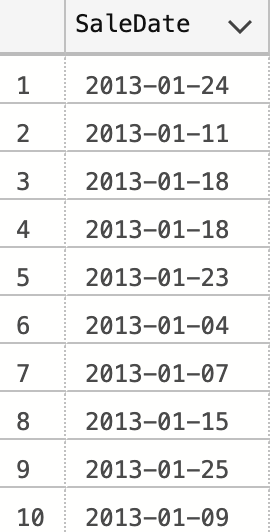

3. Fill NULLs in PropertyAddress
```
-- 3. Populate Property Address data
---- Select rows without PropertyAddress
SELECT TOP 10 ParcelID, PropertyAddress
FROM NashvilleHousing
WHERE PropertyAddress IS NULL
```
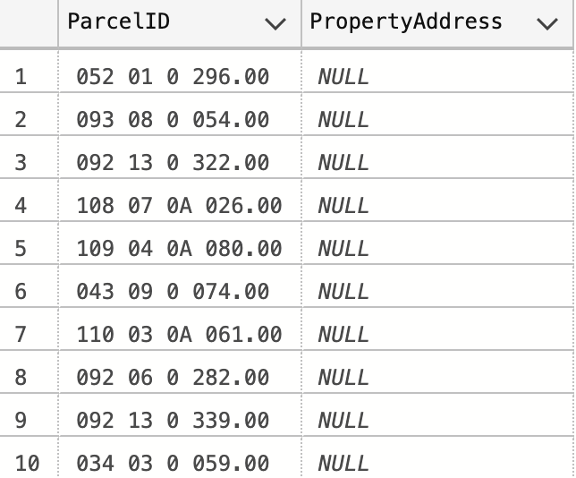

```
---- Select pairs of rows {a, b} where ParcelID are the same
---- where a's PropertyAddress is NULL and b's is NOT NULL
---- Preview replacing a's PropertyAddress  with b's
SELECT TOP 10 a.ParcelID, a.PropertyAddress, b.ParcelID, b.PropertyAddress, ISNULL(a.PropertyAddress, b.PropertyAddress)  
FROM NashvilleHousing a
JOIN NashvilleHousing b
    ON a.ParcelID = b.ParcelID
WHERE a.PropertyAddress IS NULL
    AND b.PropertyAddress IS NOT NULL
```
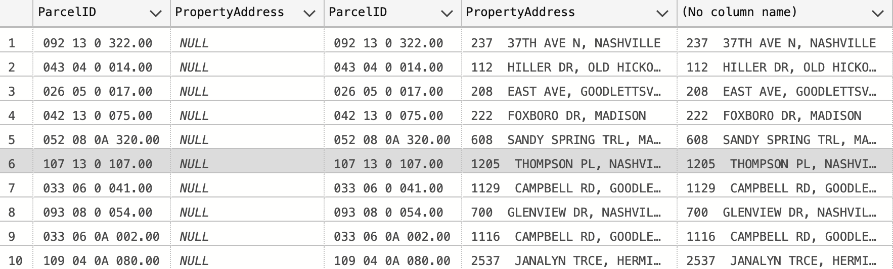

```
---- Update a's PropertyAddress with the b's PropertyAddress
UPDATE a
SET PropertyAddress = ISNULL(a.PropertyAddress,b.PropertyAddress)
FROM NashvilleHousing a
JOIN NashvilleHousing b
        ON a.ParcelID = b.ParcelID
        AND a.[UniqueID] <> b.[UniqueID]
WHERE a.PropertyAddress IS NULL

---- Confirm now all rows have PropertyAddress
SELECT TOP 10 ParcelID, PropertyAddress
FROM NashvilleHousing
WHERE PropertyAddress IS NULL
```


4. Break PropertyAddress into columns (Address, City)
```
-- 4. Break PropertyAddress into columns (Address, City)
---- Preview columns to add
SELECT TOP 10
PropertyAddress,
SUBSTRING(PropertyAddress, 1, CHARINDEX(',', PropertyAddress) - 1) as Address,
SUBSTRING(PropertyAddress, CHARINDEX(',', PropertyAddress) + 1, LEN(PropertyAddress)) as City
FROM NashvilleHousing
```
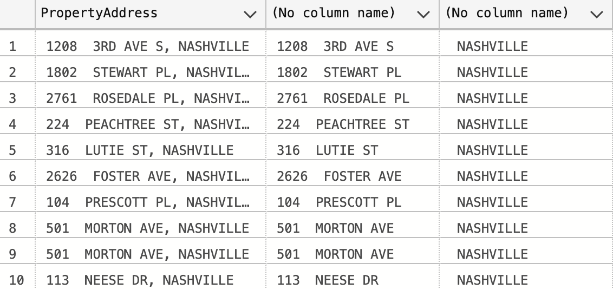

```
---- Add PropertySplitAddress and PropertySplitCity columns
ALTER TABLE NashvilleHousing
ADD PropertySplitAddress VARCHAR(255);
GO

UPDATE NashvilleHousing
SET PropertySplitAddress = SUBSTRING(PropertyAddress, 1, CHARINDEX(',', PropertyAddress) -1 )

ALTER TABLE NashvilleHousing
ADD PropertySplitCity VARCHAR(255)
GO

UPDATE NashvilleHousing
SET PropertySplitCity = SUBSTRING(PropertyAddress, CHARINDEX(',', PropertyAddress) + 1 , LEN(PropertyAddress))

---- Confirm columns are added
SELECT TOP 10 PropertyAddress, PropertySplitAddress, PropertySplitCity 
FROM NashvilleHousing
```
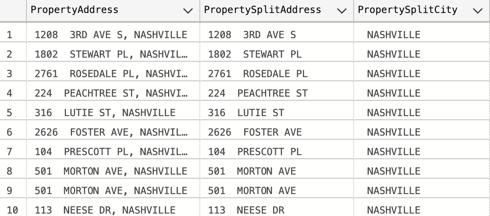

5. Break OwnerAddress into columns (Address, City, State)
```
-- 5. Break OwnerAddress into columns (Address, City, State)
---- Preview columns to add
SELECT TOP 10
OwnerAddress,
PARSENAME(REPLACE(OwnerAddress, ',', '.') , 3),
PARSENAME(REPLACE(OwnerAddress, ',', '.') , 2),
PARSENAME(REPLACE(OwnerAddress, ',', '.') , 1)
FROM NashvilleHousing

---- Add OwnerSplitAddress, OwnerSplitCity, and OwnerSplitState columns
ALTER TABLE NashvilleHousing
ADD OwnerSplitAddress VARCHAR(255)
GO
```
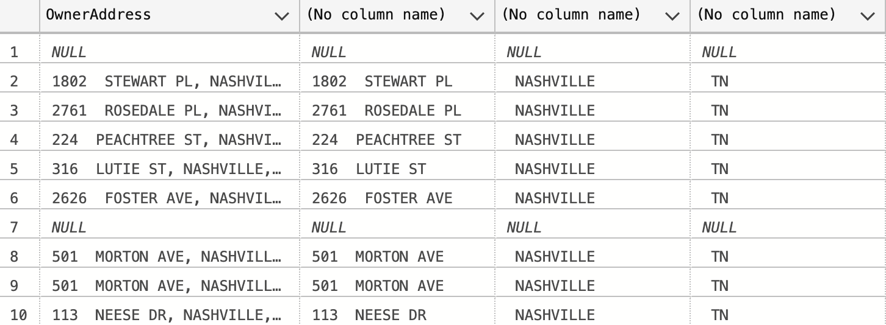

```
Update NashvilleHousing
SET OwnerSplitAddress = PARSENAME(REPLACE(OwnerAddress, ',', '.') , 3)

ALTER TABLE NashvilleHousing
ADD OwnerSplitCity VARCHAR(255)
GO

Update NashvilleHousing
SET OwnerSplitCity = PARSENAME(REPLACE(OwnerAddress, ',', '.') , 2)

ALTER TABLE NashvilleHousing
ADD OwnerSplitState VARCHAR(255)
GO

Update NashvilleHousing
SET OwnerSplitState = PARSENAME(REPLACE(OwnerAddress, ',', '.') , 1)

---- Confirm columns are added
SELECT TOP 10 OwnerAddress, OwnerSplitAddress, OwnerSplitCity, OwnerSplitState 
FROM NashvilleHousing
```
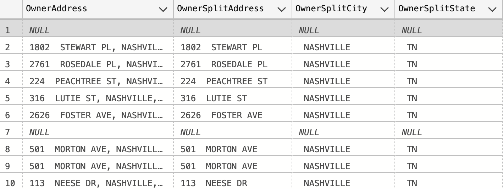

Unfortunately we don't have a way to fill the NULLs for OwnerAddress like we did for PropertyAddress. This shows that data cleaning has limitations – missing data cannot invented out of thin air. Obtain high-quality data is important!

6. Change Y and N to Yes and No in SoldAsVacant
```
-- 6. Change Y and N to Yes and No in "Sold as Vacant" field
---- Select current SoldAsVacant values
SELECT Distinct(SoldAsVacant), Count(SoldAsVacant)
FROM NashvilleHousing
GROUP BY SoldAsVacant
```
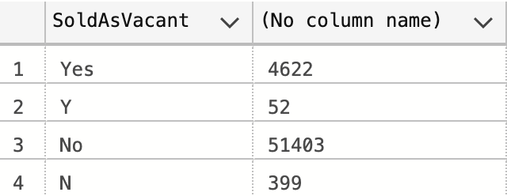

```
---- Preview updating 'Y' and 'N' to 'Yes' and 'No'
SELECT TOP 10 SoldAsVacant, 
    CASE WHEN SoldAsVacant = 'Y' THEN 'Yes'
        WHEN SoldAsVacant = 'N' THEN 'No'
        ELSE SoldAsVacant
    END
FROM NashvilleHousing
WHERE SoldAsVacant = 'Y' OR SoldAsVacant = 'N'
```
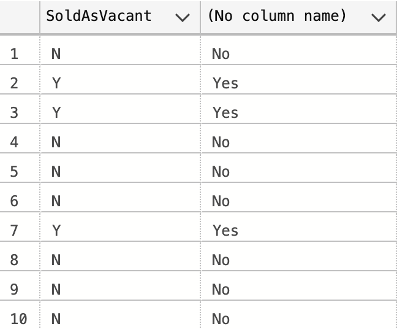

```
---- Update 'Y' and 'N' to 'Yes' and 'No''
UPDATE NashvilleHousing
SET SoldAsVacant = 
    CASE WHEN SoldAsVacant = 'Y' THEN 'Yes'
        WHEN SoldAsVacant = 'N' THEN 'No'
        ELSE SoldAsVacant
    END

---- Confirm 'Y' and 'N' have been replaced
SELECT Distinct(SoldAsVacant), Count(SoldAsVacant)
FROM NashvilleHousing
GROUP BY SoldAsVacant
```
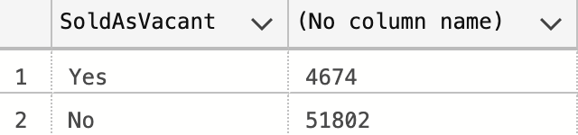

7. Remove Duplicate Rows
```
-- 7. Remove Duplicates
---- View duplicate rows with CTE
;WITH RowCntCTE AS(  -- WITH needs the previous statement to end with ;
    SELECT ROW_NUMBER() OVER (
        PARTITION BY 
            ParcelID,
            PropertyAddress,
            SalePrice,
            SaleDate,
            LegalReference
            ORDER BY UniqueID
        ) row_cnt, *
    FROM NashvilleHousing
)
SELECT TOP 10 *
FROM RowCntCTE
WHERE row_cnt > 1
```
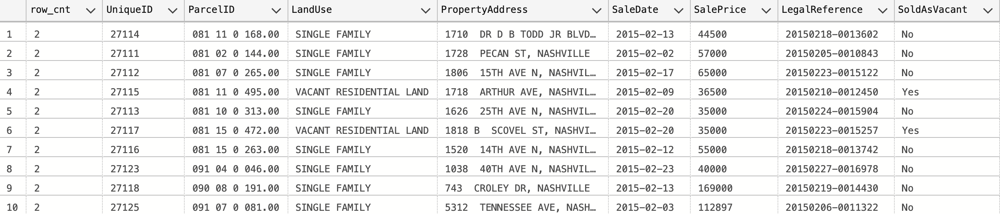

```
---- Remove duplicate rows
;WITH RowCntCTE AS(
    SELECT ROW_NUMBER() OVER (
        PARTITION BY 
            ParcelID,
            PropertyAddress,
            SalePrice,
            SaleDate,
            LegalReference
            ORDER BY UniqueID
        ) row_cnt, *
    FROM NashvilleHousing
)
DELETE
FROM RowCntCTE
WHERE row_cnt > 1

---- Confirm duplicate rows have been removed
;WITH RowCntCTE AS(
    SELECT ROW_NUMBER() OVER (
        PARTITION BY 
            ParcelID,
            PropertyAddress,
            SalePrice,
            SaleDate,
            LegalReference
            ORDER BY UniqueID
        ) row_cnt, *
    FROM NashvilleHousing
)
SELECT TOP 10 *
FROM RowCntCTE
WHERE row_cnt > 1
```


8. Delete Unused Columns
```
-- 8. Delete Unused Columns
---- View table and determine columns to drop
SELECT TOP 10 * 
FROM NashvilleHousing
```
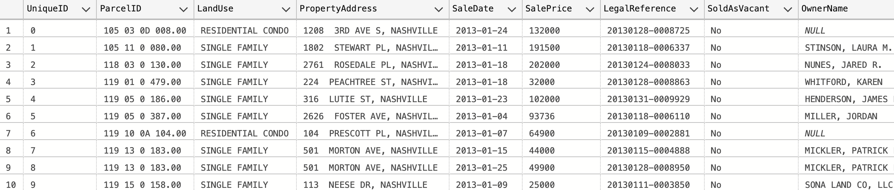

```
---- Drop unused columns
ALTER TABLE NashvilleHousing
DROP COLUMN OwnerAddress, TaxDistrict, PropertyAddress

---- View final table
SELECT * 
FROM NashvilleHousing
```
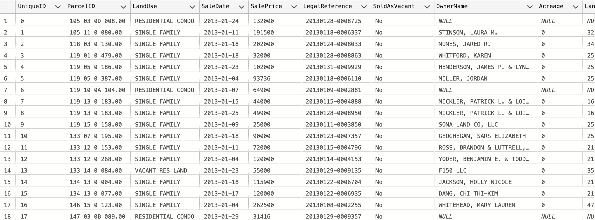
